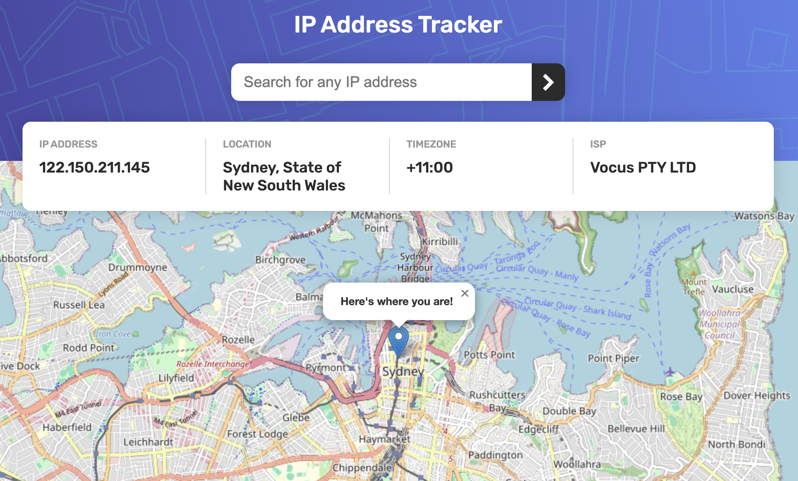
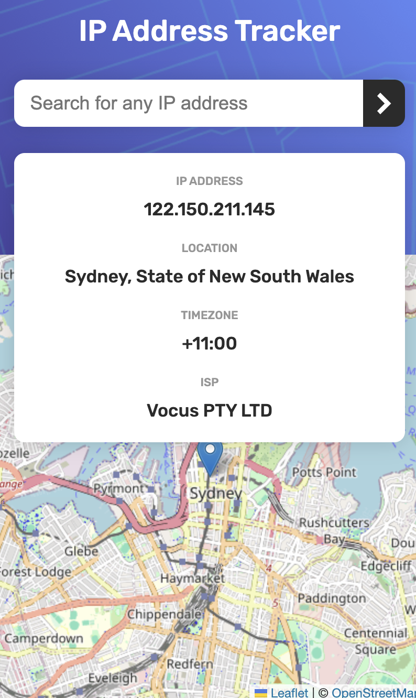

This is an app that searches a given ip address and provides details about the location. The two api's used to make this happen are Leaflet and Ipify. On initial page load the clients ip address is used for the location.

Used to build: html, css, javascript

